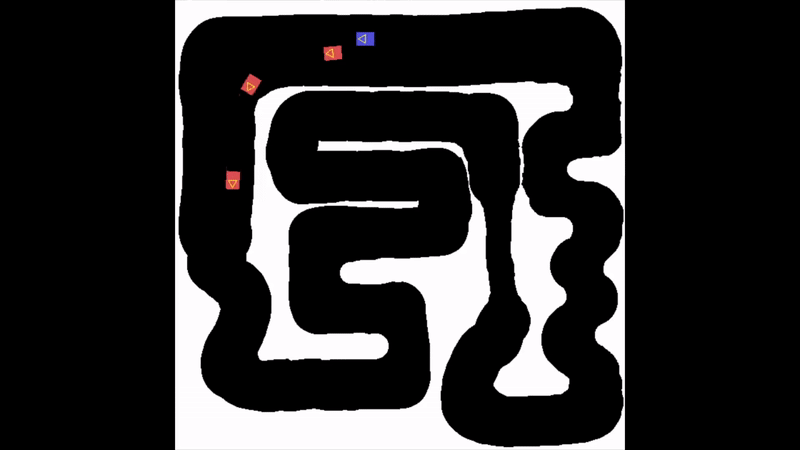

# BotMobile

A reinforcement learning based approach to prepare for the Ecole Normale Supérieure (ENS Paris-Saclay) autonomous 1:10 vehicles race of 2022.

The RC car is equiped with a RPLidar (A2M8) and a Raspberry Pi 4 to control it.

## How it works

A PPO model implemented in stable-baselines 3 is trained in a car race simulation. This simulation is compiled from C code using CFFI to make it faster to run and use it from python.

The simulation can run at about 1000 step/second on a recent i7 laptop while training the PPO model on CPU.
Each step corresponds to 1/10 second.
The models where trained around 12M steps with attempts to train them during 20 to 50M steps.

The training logs are available in the "race_logs/" directory and viewable using tensorboard.

Here is one of the latest models after training during 20M steps and a 1e-6 learning rate.
<video width="320" height="240" controls>
  <source src="https://github.com/EwenCollin/BotMobile/raw/main/2022-12-23%2013-11-00.mp4" type="video/mp4">
</video>

The trained model (in blue) is competing against previous recorded versions of itself (in red).

To make model training faster, the task was automated with config files for training stored in the "schedule/" folder.

## Result

Here is the car driving with another trained model.

https://user-images.githubusercontent.com/51873655/209349502-06feb340-f852-4888-b691-20ef1ea4e46e.mp4

Car testing on april 1st 2022 at ENS Paris-Saclay on the training circuit.

As the simulation was quite far from reality, the car is less efficient and precise in its moves.
Furthermore, the car was not trained with the full lidar scan but uses only a small subset of the rays: only a 90 range centered in front of it.
